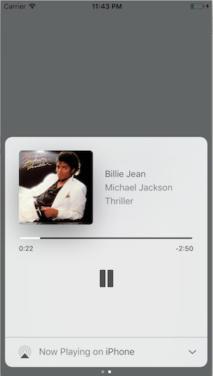

# react-native-music-control

React Native module to control remote controls on lockscreen + display Now playing Info on lockscreen (MPNowPlayingInfoCenter)

Play well with React [Native Sound](https://github.com/zmxv/react-native-sound)

Mix between :

* https://github.com/Muntligt/cordova-plugin-remotecommand (iOS)
* https://github.com/Muntligt/cordova-plugin-nowplaying (iOS)
* https://github.com/homerours/cordova-music-controls-plugin (Android)
* https://github.com/shi11/RemoteControls/pull/32 (Android)

Project using it :

* https://github.com/just-team/react-native-youtube-player



# Install

**Add it to your project**

```
npm install react-native-music-control --save
```

## iOS

### Automatic

`react-native link`

:warning: You must enable Audio Background mode in XCode project settings :


### Manual

In XCode, right click Libraries. Click Add Files to "[Your project]". Navigate to node_modules/react-native-music-control. Add the file MusicControl.xcodeproj.

In the Project Navigator, select your project. Click the build target. Click Build Phases. Expand Link Binary With Libraries. Click the plus button and add libMusicControl.a under Workspace.


## Android

### Automatic

`react-native link`

### Manual

**android/app/build.gradle**

```diff
dependencies {
    ...
    compile "com.facebook.react:react-native:+"  // From node_modules
+   compile project(':react-native-music-control')
}
```

**android/settings.gradle**
```diff
...
include ':app'
+include ':react-native-music-control'
+project(':react-native-music-control').projectDir = new File(rootProject.projectDir, '../node_modules/react-native-music-control/android')
```

**MainActivity.java**

```diff
+import com.tanguyantoine.react.MusicControl;

public class MainApplication extends Application implements ReactApplication {
    //......

    @Override
    protected List<ReactPackage> getPackages() {
        return Arrays.<ReactPackage>asList(
+           new MusicControl(),
            new MainReactPackage()
        );
    }

    //......
  }
```

# Use

```javascript
import MusicControl from 'react-native-music-control';
```

### Now Playing

This method enables the music controls. To disable them, use `resetNowPlaying()`

You should call this method after a sound is playing.

For Android's rating system, remove the `rating` value for unrated tracks, use boolean for RATING_HEART or RATING_THUMBS_UP_DOWN and use a number for other types. Note: To use custom types, you have to define the type with `updatePlayback` before calling this function.

```javascript
MusicControl.setNowPlaying({
  title: 'Billie Jean',
  artwork: 'https://i.imgur.com/e1cpwdo.png', // URL or RN's image require()
  artist: 'Michael Jackson',
  album: 'Thriller',
  genre: 'Post-disco, Rhythm and Blues, Funk, Dance-pop',
  duration: 294, // (Seconds)
  description: '', // Android Only
  color: 0xFFFFFF, // Notification Color - Android Only
  date: '1983-01-02T00:00:00Z', // Release Date (RFC 3339) - Android Only
  rating: 84, // Android Only (Boolean or Number depending on the type)
  notificationIcon: 'my_custom_icon' // Android Only (String), Android Drawable resource name for a custom notification icon
})
```

### Playback

You don't need to call this method filling all properties, but you should always fill `elapsedTime` for iOS support and better performance on Android.

You also don't need to call this method repeatedly to update the `elapsedTime`, only call it when you need to update any other property

```javascript
MusicControl.updatePlayback({
  state: MusicControl.STATE_PLAYING, // (STATE_ERROR, STATE_STOPPED, STATE_PLAYING, STATE_PAUSED, STATE_BUFFERING)
  speed: 1, // Playback Rate
  elapsedTime: 103, // (Seconds)
  bufferedTime: 200, // Android Only (Seconds)
  volume: 10, // Android Only (Number from 0 to maxVolume) - Only used when remoteVolume is enabled
  maxVolume: 10, // Android Only (Number) - Only used when remoteVolume is enabled
  rating: MusicControl.RATING_PERCENTAGE // Android Only (RATING_HEART, RATING_THUMBS_UP_DOWN, RATING_3_STARS, RATING_4_STARS, RATING_5_STARS, RATING_PERCENTAGE)
})
```

**Examples**
```javascript
// Changes the state to paused
MusicControl.updatePlayback({
  state: MusicControl.STATE_PAUSED,
  elapsedTime: 135
})

// Changes the volume
MusicControl.updatePlayback({
  volume: 9, // Android Only
  elapsedTime: 167
})
```

### Reset now playing

Resets and hides the music controls

```javascript
MusicControl.resetNowPlaying()
```

### Enable/disable controls

**iOS**: Lockscreen

**Android**: Notification and external devices (smartwatches, cars)

```javascript
// Basic Controls
MusicControl.enableControl('play', true)
MusicControl.enableControl('pause', true)
MusicControl.enableControl('stop', false)
MusicControl.enableControl('nextTrack', true)
MusicControl.enableControl('previousTrack', false)

// Seeking
MusicControl.enableControl('seekForward', false) // iOS only
MusicControl.enableControl('seekBackward', false) // iOS only
MusicControl.enableControl('seek', false) // Android only
MusicControl.enableControl('skipForward', false)
MusicControl.enableControl('skipBackward', false)

// Android Specific Options
MusicControl.enableControl('setRating', false)
MusicControl.enableControl('volume', true) // Only affected when remoteVolume is enabled
MusicControl.enableControl('remoteVolume', false)

// iOS Specific Options
MusicControl.enableControl('enableLanguageOption', false)
MusicControl.enableControl('disableLanguageOption', false)
```

`skipBackward` and `skipForward` controls on accept additional configuration options with `interval` key:

```javascript
MusicControl.enableControl('skipBackward', true, {interval: 15}))
MusicControl.enableControl('skipForward', true, {interval: 30}))
```

Important Notes: 
* Android only supports the intervals 5, 10, & 30, while iOS supports any number
* The interval value only changes what number displays in the UI, the actual logic to skip forward or backward by a given amount must be implemented in the appropriate callbacks
* When using [react-native-sound](https://github.com/zmxv/react-native-sound) for audio playback, make sure that on iOS `mixWithOthers` is set to `false` in [`Sound.setCategory(value, mixWithOthers)`](https://github.com/zmxv/react-native-sound#soundsetcategoryvalue-mixwithothers-ios-only). MusicControl will not work on a real device when this is set to `true`.

There is also a `closeNotification` control on Android controls the swipe behavior of the audio playing notification, and accepts additional configuration options with the `when` key:

```javascript
// Always allow user to close notification on swipe
MusicControl.enableControl('closeNotification', true, {when: 'always'})

// Default - Allow user to close notification on swipe when audio is paused
MusicControl.enableControl('closeNotification', true, {when: 'paused'})

// Never allow user to close notification on swipe
MusicControl.enableControl('closeNotification', true, {when: 'never'})
```

### Register to events

```javascript
componentDidMount() {
    MusicControl.enableBackgroundMode(true);

    MusicControl.on('play', ()=> {
      this.props.dispatch(playRemoteControl());
    })

    // on iOS this event will also be triggered by interruptions (incoming calls) and audio router change events
    // happening when headphones are unplugged or a bluetooth audio peripheral disconnects from the device
    MusicControl.on('pause', ()=> {
      this.props.dispatch(pauseRemoteControl());
    })

    MusicControl.on('stop', ()=> {
      this.props.dispatch(stopRemoteControl());
    })

    MusicControl.on('nextTrack', ()=> {
      this.props.dispatch(nextRemoteControl());
    })

    MusicControl.on('previousTrack', ()=> {
      this.props.dispatch(previousRemoteControl());
    })

    MusicControl.on('seekForward', ()=> {});
    MusicControl.on('seekBackward', ()=> {});

    MusicControl.on('seek', (pos)=> {}); // Android only (Seconds)
    MusicControl.on('volume', (volume)=> {}); // Android only (0 to maxVolume) - Only fired when remoteVolume is enabled

    // Android Only (Boolean for RATING_HEART or RATING_THUMBS_UP_DOWN, Number for other types)
    MusicControl.on('setRating', (rating)=> {});

    MusicControl.on('togglePlayPause', ()=> {}); // iOS only
    MusicControl.on('enableLanguageOption', ()=> {}); // iOS only
    MusicControl.on('disableLanguageOption', ()=> {}); // iOS only
    MusicControl.on('skipForward', ()=> {});
    MusicControl.on('skipBackward', ()=> {});

    // Android Only
    MusicControl.on('closeNotification', ()=> {
      this.props.dispatch(onAudioEnd());
    })
}
```

### Customization

It is possible to customize the icon used in the notification on Android.
By default you can add a drawable resource to your package with the file name `music_control_icon` and the notification will use your custom icon.
If you need to specify a custom icon name, or change your notification icon during runtime, the `setNowPlaying` function accepts a string 
for an Android drawable resource name in the `notificationIcon` prop. Keep in mind that just like with `music_control_icon` the resource specified has
to be in the drawable package of your Android app.

```javascript
  MusicControl.setCustomNotificationIcon('my_custom_icon');
```

# TODOS

- [x] Android support
- [ ] Test
- [x] Publish package
- [x] React-Native link configuration for Android
- [x] React-Native link configuration for iOS
- [x] Android : Handle remote events
- [x] Android : Display cover artwork


# Contributing

### Of coursssssseeeeee. I'm waiting your PR :)
